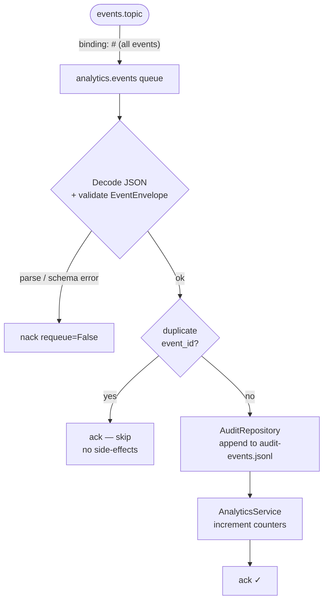
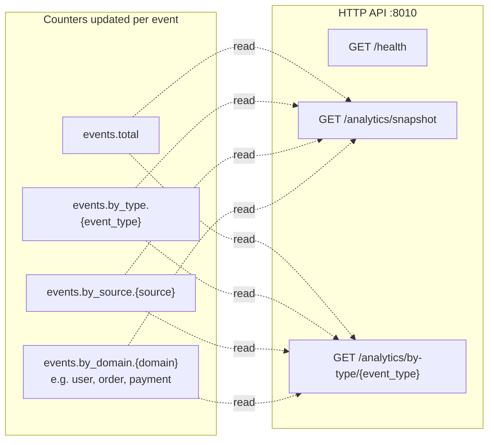

# event-platform-analytics-audit-service

Async **RabbitMQ consumer** for the event platform: subscribes to the `events.topic` exchange with binding key `#`, receives **every** published event, writes an append-only **audit trail** (JSON Lines), and maintains in-memory **analytics counters** (by event type, source, and domain). Exposes a lightweight HTTP API for health checks and counter snapshots. Independent of the notification and retry flows — if this service is down, all other services continue operating normally.

## Repositories

[GitHub: Elena-sky](https://github.com/Elena-sky)

- [event-platform-gateway-api](https://github.com/Elena-sky/event-platform-gateway-api)
- [event-platform-notification-service](https://github.com/Elena-sky/event-platform-notification-service)
- [event-platform-analytics-audit-service](https://github.com/Elena-sky/event-platform-analytics-audit-service)
- [event-platform-retry-orchestrator-service](https://github.com/Elena-sky/event-platform-retry-orchestrator-service)
- [event-platform-infra](https://github.com/Elena-sky/event-platform-infra)

## Architecture

This service is a **fan-out consumer** — it receives every event independently of the notification flow. If analytics-audit-service is down, gateway-api and notification-service continue operating without any impact.

## Flow





## Requirements

- **Python 3.12 or 3.13** (3.13 recommended). On **Python 3.14**, installing `pydantic-core` from `requirements.txt` often fails during build — use 3.12/3.13 or wait for wheels for your Python version.
- A running **RabbitMQ** instance (local or from [event-platform-infra](https://github.com/Elena-sky/event-platform-infra)).
- Exchange topology must match the **gateway** (`events.topic` by default).

## Development

```bash
pip install -r requirements.txt
ruff check app tests
ruff format app tests
pytest
```

Tests use `monkeypatch` + `unittest.mock`; no broker or file I/O required.

**CI:** push/PR to `main` or `master` runs Ruff and pytest (see `.github/workflows/ci.yml`).

## Quick start

### 1. Infrastructure (RabbitMQ)

From the `event-platform-infra` directory:

```bash
docker compose up -d
```

Defaults: AMQP `localhost:5672`, user/password `admin` / `admin`, management UI: http://localhost:15672

### 2. Configuration

```bash
cp .env.example .env
```

Edit `.env` as needed. **All variables** from `.env.example` must be set — there are no in-code defaults (`app/core/config.py`). Key variables:

| Variable | Description |
|---|---|
| `RABBITMQ_BINDING_KEYS` | Comma-separated AMQP binding keys. Default `#` receives every event. |
| `RABBITMQ_PREFETCH` | Consumer prefetch count (tune independently of notification service). |
| `AUDIT_LOG_PATH` | Path to the append-only JSON Lines audit file (e.g. `./data/audit-events.jsonl`). |

### 3. Virtual environment and dependencies

```bash
python3.13 -m venv .venv
source .venv/bin/activate   # Windows: .venv\Scripts\activate
pip install -r requirements.txt
```

### 4. Run locally

From the repository root:

```bash
python -m app.main
```

This starts both the AMQP consumer and the HTTP server (`APP_PORT`, default `8010`) concurrently via `asyncio.gather`.

If RabbitMQ is unreachable, the process exits with an error.

### 5. Verify

```bash
# Health
curl http://localhost:8010/health

# Analytics snapshot (all counters)
curl http://localhost:8010/analytics/snapshot

# Count for a specific event type
curl http://localhost:8010/analytics/by-type/user.registered
```

After sending a few events through gateway-api, `snapshot` returns:

```json
{
  "events.total": 2,
  "events.by_type.user.registered": 1,
  "events.by_type.order.created": 1,
  "events.by_source.frontend": 1,
  "events.by_source.checkout-api": 1,
  "events.by_domain.user": 1,
  "events.by_domain.order": 1
}
```

## Event processing

- **Any event** → appended to `AUDIT_LOG_PATH` as a JSON line → analytics counters updated.
- **Duplicate** (same `event_id`) → skipped (`ack`); neither audit log nor counters are affected.
- **Parse error** (bad JSON or schema mismatch) → `nack(requeue=False)` — message is discarded, no silent drop.

## Audit log format

Each line in `AUDIT_LOG_PATH` is a JSON object:

```json
{"event_id": "...", "event_type": "user.registered", "source": "frontend", "occurred_at": "...", "payload": {...}}
```

The file is append-only and safe to tail, rotate, or ship to external storage.
